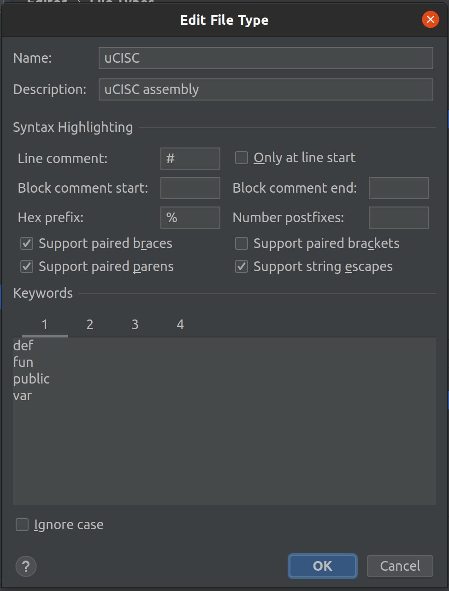
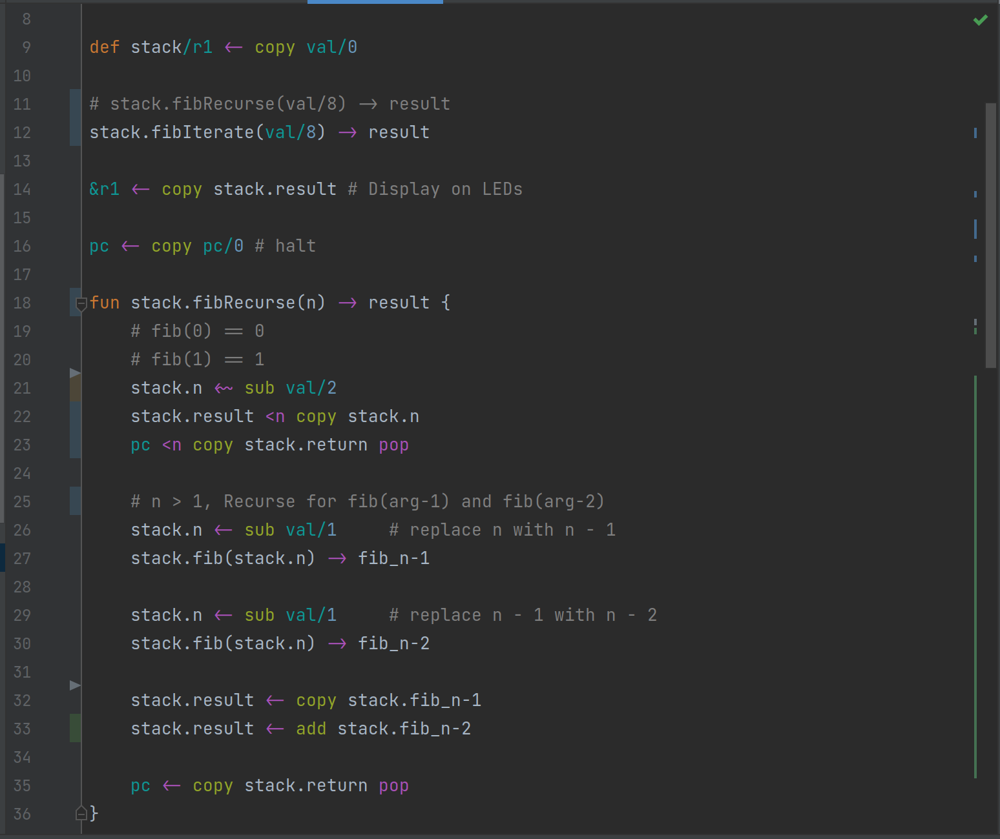

## uCISC Programming Guide

1. [Getting Started](1.0_Getting_Started.md)
   1. [Configuring IntelliJ](1.1_Configuring_IntelliJ.md) <-- you are here
   2. [Configuring VIM](1.2_Configuring_VIM.md)
   3. [Compiling uCISC Code](1.3_Compiling_uCISC_Code.md)
   4. [Using the uCISC Simulator](1.4_Simulating_uCISC.md)
   5. [Using the uCISC Soft Core](1.5_Running_uCISC_Soft_Core.md)
2. [Introduction to Programming With uCISC](2.0_Program_With_uCISC.md)
   1. [Accessing External Devices](2.1_Accessing_Devices.md)
   2. [Common Devices](2.2.0_Common_Devices.md)
      1. [GPIO](2.2.1_GPIO_Devices.md)
      2. [I2C](2.2.2_I2C_Devices.md)
      3. [UART](2.2.3_UART_Devices.md)
      4. [Video Devices](2.2.4_Video_Devices.md)
   3. [Advanced uCISC Programming Techiques](2.3_Advanced_Programming_Techniques.md)
3. [uCISC Syntax Quick Reference](3_Syntax_Quick_Reference.md)
4. [Standard Libraries](04_Syntax_Quick_Reference.md)
5. [Instruction Set Details](5_Instruction_Set_Details.md)

## Configuring IntelliJ for uCISC Development

The main thing to do is create the syntax highlighting setup.

1. Go to File > Settings... > Editor > File Types
2. Under the "Recognized File Types" section, click the plus
3. Configure the following settings:
   1. Name: uCISC
   2. Description: uCISC Assembly
   3. Line comment: #
   4. Leave "Only at line start" unchecked
   5. No block comment settings
   6. Hex prefix: %
   7. No number postfixes
   8. Check "Support paired braces", "Support paired parens", "Support string escapes"
   9. Leave "Support paired brackets" unchecked
   10. Leave "Ignore case" unchecked



4. Paste the four sections of keywords from below into the for keyword tabs
5. Enable Ligatures (recommended)
   1. File > Settings... > Editor > Font
   2. Select "Enable ligatures"
   3. Select a font that supports ligatures "JetBrains Mono" or "Fira Code"

With dark mode on, your file should look something like this:



#### Section 1 Keywords

```
def
fun
public
var
```

#### Section 2 Keywords

```
->
<
<!
<!?
<#
<&
<+
<-
<0
<0?
<1
<n
<n?
<o
<o?
<p
<p?
<|#
<|&
<|+
<|-
<|0
<|1
<|n
<|p
<|~
<~
pop
push
```

#### Section 3 Keywords

```
&
/
flags
pc
r1
r2
r3
r4
r5
r6
val
```

#### Section 4 Keywords

```
add
addc
and
copy
inv
lsb
msb
mult
multsw
or
shl
shr
sub
swap
xor
```