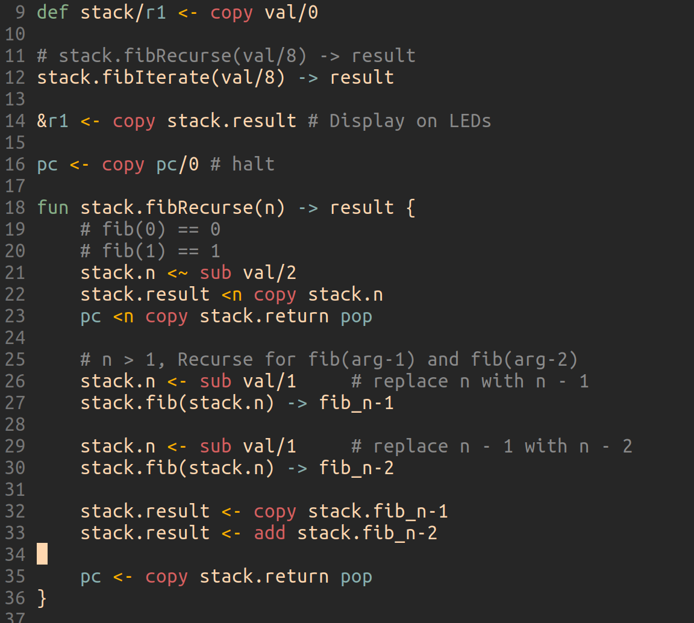

## uCISC Programming Guide

1. [Getting Started](1.0_Getting_Started.md)
   1. [Configuring IntelliJ](1.1_Configuring_IntelliJ.md)
   2. [Configuring VIM](1.2_Configuring_VIM.md) <-- you are here
   3. [Compiling uCISC Code](1.3_Compiling_uCISC_Code.md)
   4. [Using the uCISC Simulator](1.4_Simulating_uCISC.md)
   5. [Using the uCISC Soft Core](1.5_Running_uCISC_Soft_Core.md)
2. [Introduction to Programming With uCISC](2.0_Program_With_uCISC.md)
   1. [Accessing External Devices](2.1_Accessing_Devices.md)
   2. [Common Devices](2.2.0_Common_Devices.md)
      1. [GPIO](2.2.1_GPIO_Devices.md)
      2. [I2C](2.2.2_I2C_Devices.md)
      3. [UART](2.2.3_UART_Devices.md)
      4. [Video Devices](2.2.4_Video_Devices.md)
   3. [Advanced uCISC Programming Techniques](2.3_Advanced_Programming_Techniques.md)
3. [uCISC Syntax Quick Reference](3_Syntax_Quick_Reference.md)
4. [Standard Libraries](4_Standard_Libraries.md)
5. [Instruction Set Details](5_Instruction_Set_Details.md)

## Configuring VIM

There is a uCISC syntax highlighting file under extras. You can source it manually
or copy it to `~/.vim/syntax/ucisc.vim` to be used automatically (depending on your
vim configuration).

YMMV, but my gruvbox darkmode looks like this:

